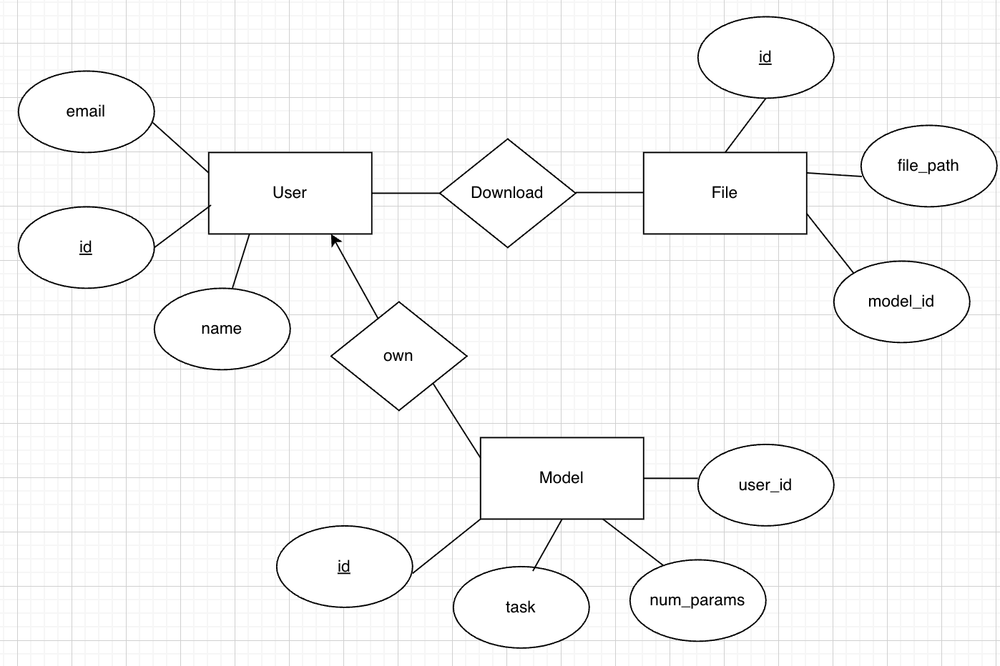
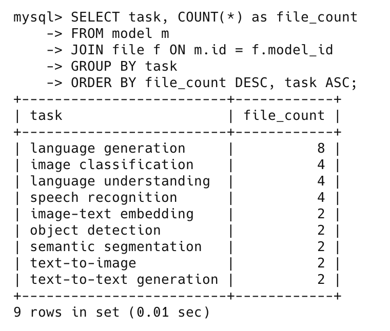
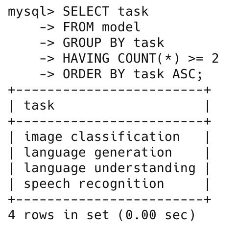
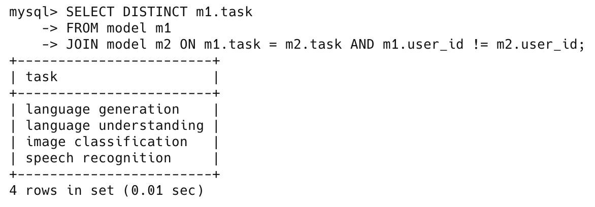
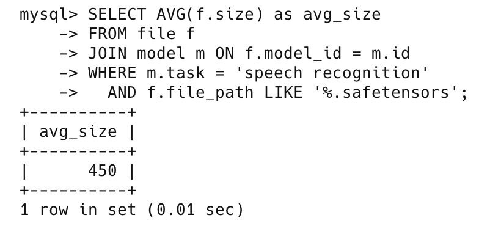
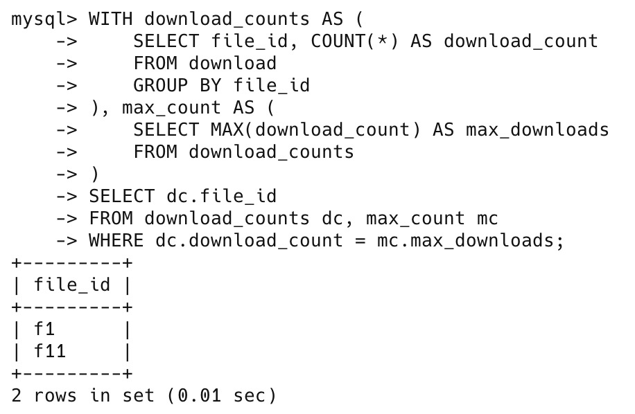
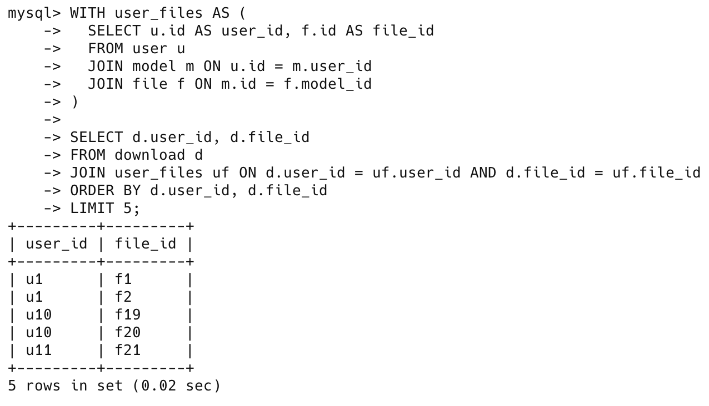
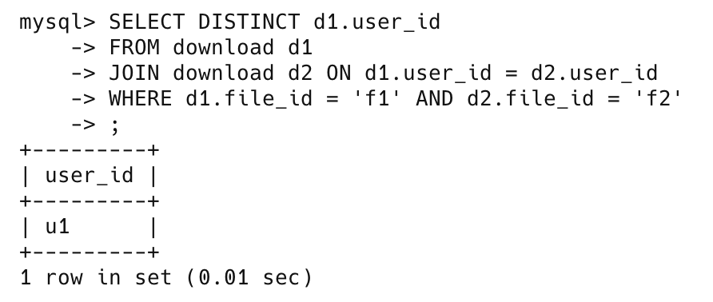
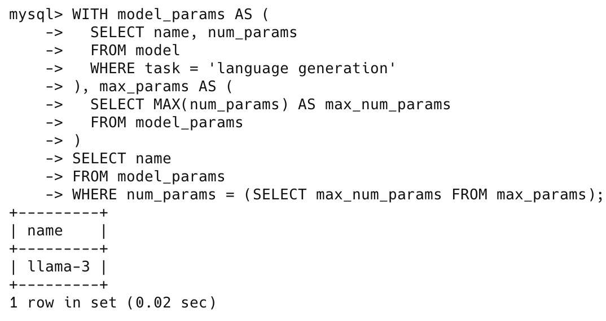

# Homework 3: Data Modeling and SQL

## ER Diagram


## Questions
1. For each task, find out how many files there are for the task. Order the task in the descending order of the file counts. If there are multiple tasks with the same file count, show these tasks in the ascending order of task names.
```sql
SELECT task, COUNT(*) as file_count
FROM model m
JOIN file f ON m.id = f.model_id
GROUP BY task
ORDER BY file_count DESC, task ASC;
```

Result:


2. Find out (names of) tasks which have at least two models available in the repository. Output only the task names in the ascending order.
```sql
SELECT task 
FROM model
GROUP BY task
HAVING COUNT(*) >= 2
ORDER BY task ASC;
```

Result:


3. Without using group by and aggregation, find out tasks which have at least two models available in the repository that were contributed by different users. Return (unique) task names.
```sql
SELECT DISTINCT m1.task
FROM model m1
JOIN model m2 ON m1.task = m2.task AND m1.user_id != m2.user_id;
```

Result:


4. Compute the average size of the files which are for the 'speech-recognition' task and have a path that ends with ".safetensors".
```sql
SELECT AVG(f.size) as avg_size
FROM file f
JOIN model m ON f.model_id = m.id
WHERE m.task = 'speech recognition' 
  AND f.file_path LIKE '%.safetensors';
```
Result:


5. Using CTE (common table expression), find ids of files that have been downloaded most frequently. Note there may be multiple such files.
```sql
WITH download_counts AS (
    SELECT file_id, COUNT(*) AS download_count
    FROM download
    GROUP BY file_id
), max_count AS (
    SELECT MAX(download_count) AS max_downloads
    FROM download_counts
)
SELECT dc.file_id
FROM download_counts dc, max_count mc
WHERE dc.download_count = mc.max_downloads; 
```

Result:

6. Find users who downloaded their own files. Return the user ids and file ids. Order the results first by user id and then by file id, and return only the first 5 results.
```sql
WITH user_files AS (
  SELECT u.id AS user_id, f.id AS file_id
  FROM user u
  JOIN model m ON u.id = m.user_id
  JOIN file f ON m.id = f.model_id
)

SELECT d.user_id, d.file_id
FROM download d
JOIN user_files uf ON d.user_id = uf.user_id AND d.file_id = uf.file_id
ORDER BY d.user_id, d.file_id
LIMIT 5;
```
Result:


7. Find (unique) ids of users who downloaded both files “f1” and “f2”.
```sql
SELECT DISTINCT d1.user_id
FROM download d1
JOIN download d2 ON d1.user_id = d2.user_id
WHERE d1.file_id = 'f1' AND d2.file_id = 'f2';
```
Result:


8. Using CTE, find names of "language generation" models with the largest number of parameters.
```sql
WITH model_params AS (
  SELECT name, num_params
  FROM model
  WHERE task = 'language generation'
), max_params AS (
  SELECT MAX(num_params) AS max_num_params
  FROM model_params
)
SELECT name
FROM model_params
WHERE num_params = (SELECT max_num_params FROM max_params);
```
Result:
