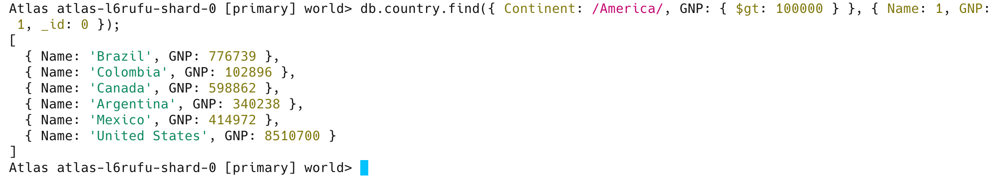
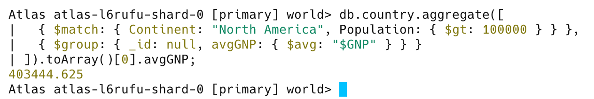
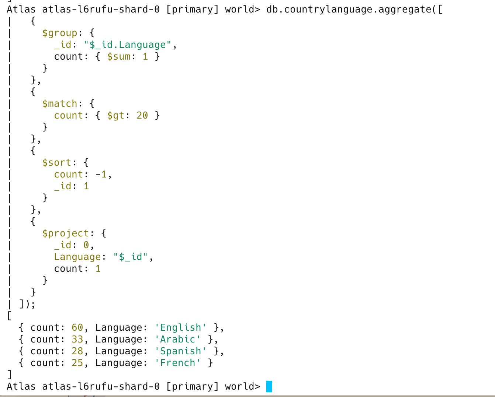
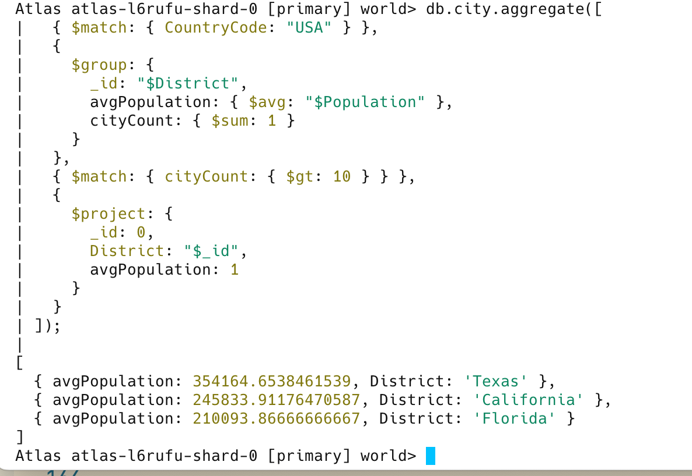
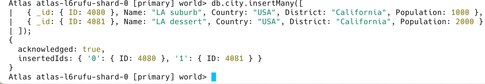
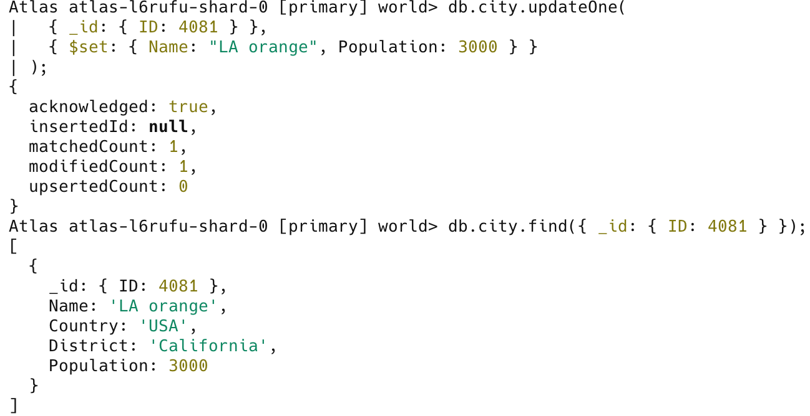
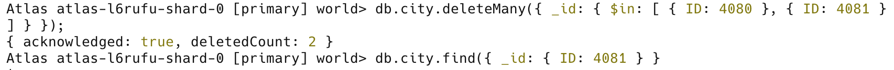

# Homework 4: MongoDB Queries
## Name: Felix Wang, USC ID: 1900370012
1. 
```sql
select count(Language)
from countrylanguage
where IsOfficial = "T" and Percentage > .5;
```

MongoDB Query:
```js
db.countrylanguage.countDocuments({ IsOfficial: "T", Percentage: { $gt: 0.5 } });
```


2.
```sql
select Name, GNP
from country
where Continent like '%America%' and GNP > 100000;
```

MongoDB Query:
```js
db.country.find({ Continent: /America/, GNP: { $gt: 100000 } }, { Name: 1, GNP: 1, _id: 0 });
``` 



3.
```sql
select avg(GNP)

from country

where Continent = 'North America' and Population > 100000;
```

MongoDB Query:
```js
db.country.aggregate([
  { $match: { Continent: "North America", Population: { $gt: 100000 } } },
  { $group: { _id: null, avgGNP: { $avg: "$GNP" } } }
]).toArray()[0].avgGNP;
```


4.
```sql
select country.Name, city.Name

from country join city on country.Capital = city.ID

order by country.Name

limit 5;

```

MongoDB Query:
```js
db.country.aggregate([
  {
    $lookup: {
      from: "city",
      localField: "Capital",
      foreignField: "_id.ID",
      as: "capital_city"
    }
  },
  { $unwind: "$capital_city" },
  { $sort: { Name: 1 } },
  {
    $project: {
      _id: 0,
      countryName: "$Name",
      cityName: "$capital_city.Name"
    }
  },
  { $limit: 5 }
]);
```


5.
```sql
select Language, count(*)

from countrylanguage

group by Language

having count(*) > 20

order by count(*) desc, Language;
```

MongoDB Query:
```js
db.countrylanguage.aggregate([
  {
    $group: {
      _id: "$_id.Language",
      count: { $sum: 1 }
    }
  },
  {
    $match: {
      count: { $gt: 20 }
    }
  },
  {
    $sort: {
      count: -1,
      _id: 1
    }
  },
  {
    $project: {
      _id: 0,
      Language: "$_id",
      count: 1
    }
  }
]);
```


6.
```sql
select District, avg(Population) 

from city

where CountryCode = "USA"

group by district

having count(*) > 10;
```

MongoDB Query:
```js
db.city.aggregate([
  { $match: { CountryCode: "USA" } },
  {
    $group: {
      _id: "$District",
      avgPopulation: { $avg: "$Population" },
      cityCount: { $sum: 1 }
    }
  },
  { $match: { cityCount: { $gt: 10 } } },
  {
    $project: {
      _id: 0,
      District: "$_id",
      avgPopulation: 1
    }
  }
]);
```


7.
```sql
insert into city values(4080, "LA suburb", "USA", "California", 1000),

 (4081, "LA dessert", "USA",  "California", 2000);
```

MongoDB Query:
```js
db.city.insertMany([
  { _id: { ID: 4080 }, Name: "LA suburb", Country: "USA", District: "California", Population: 1000 },
  { _id: { ID: 4081 }, Name: "LA dessert", Country: "USA", District: "California", Population: 2000 }
]);
```


8.
```sql
update city set `Name` = "LA orange",  Population = 3000 where ID = 4081;
```

MongoDB Query:
```js
db.city.updateOne(
  { _id: { ID: 4081 } },
  { $set: { Name: "LA orange", Population: 3000 } }
);
```



9.
```sql
delete from city where ID = 4080 or ID = 4081;
```

MongoDB Query:
```js
db.city.deleteMany({ _id: { $in: [ { ID: 4080 }, { ID: 4081 } ] } });
```

